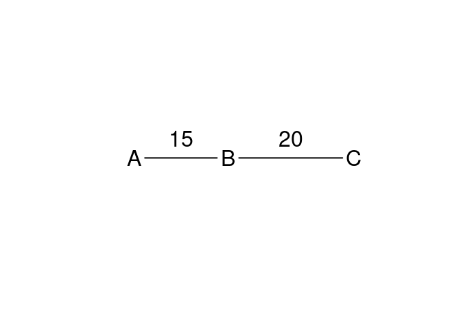
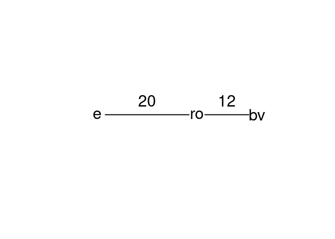

Finding 3-point cross problems can be a huge pain, so here I'll work out how to make them myself.

Imagine we have a genetic map where there are three genes (A, B, C). The map distance between A and B is X, the map distance between B and C is Y.


```r
myX=10
myY=20
geneNames = c('A','B','C')

linkageMap <- function(geneNames = c('A','B','C'), myX = 10, myY = 10, myLabels = c(myX, myY)){
myZ = myX + myY
plot(0,type='n',axes=FALSE,ann=FALSE, xlim = c(-0.3,1.3), ylim = c(0,1))
lines(c(0.05,myX/myZ-0.05), c(0.5,0.5), lwd=2)
lines(c(myX/myZ+0.05, 0.95), c(0.5,0.5), lwd=2)
text(c(0,myX/myZ,1), c(0.5,0.5,0.5), labels = geneNames, cex=2)
text(c(0.5*myX/myZ,  myX/myZ + 0.5*myY/myZ) ,c(0.6,0.6),labels=myLabels, cex=2)
}

linkageMap(myX=15, myY = 20, myLabels = c('X','Y'))
```

<!-- -->


We do a three point test cross and get $N$ progeny.

For now I'll assume that one parent is (A B C/ a b c) and the other parent is (a b c/a b c) but I can revisit this assumption later.

The following math will assume that there's no interference (can revisit this later).
Let $x$ and $y$ be the recombination frequencies, so that $x = \frac{X}{100}$ and $y = \frac{Y}{100}$. 
We can work out the proportions of all the different gametes contributed by the heterozygous parent using the following formulas.

First, the double crossovers. The probability of getting crossovers in both intervals is $x\cdot y$.

$$P(AbC) =  N\cdot (x\cdot y)/2 $$
$$P(aBc) =  N \cdot (x\cdot y)/2 $$
Next, for the single crossovers, we calcuate the probablity of crossovers occuring in one interval but not in both intervals, which is equibalent to $x - xy$ for crossovers between A and B and $y - xy$ for crossovers between B and C. 

$$P(Abc) =  N\cdot (x - xy)/2 $$
$$P(aBC) =  N\cdot (x - xy)/2 $$
and

$$P(ABc) =  N\cdot (y - xy)/2 $$
$$P(abC) =  N\cdot (y - xy)/2 $$
Finally, we figure out the frequency of non-recombinant gametes. This is a bit tricky because it's not just equivalent to $1 - x - y$ because we need to account for double crossovers. Instead, the frequency of non-recombinant gametes is $1 - x - y + xy$

$$P(ABC) =  N\cdot (1 - x - y + xy)/2 $$
$$P(abc) =  N\cdot (1 - x - y + xy)/2 $$


Now to code this up in R.

```r
calculateProgeny <- function(myX = 10, myY = 20, myN = 1000, myLoci = c('A','B','C','a','b','c')){
myx = myX/100
myy = myY/100

myDoubleCrossovers = myN * myx * myy 
myABRecombinants = myN * (myx - myx*myy)
myBCRecombinants = myN * (myy - myx*myy)
myNonrecombinants = myN* (1 - myx - myy + myx*myy)

#myNumbers =c( myNonrecombinants/2, myNonrecombinants/2, 
#              myABRecombinants/2, myABRecombinants/2, 
#              myBCRecombinants/2, myBCRecombinants/2,
#              myDoubleCrossovers/2, myDoubleCrossovers/2)

#myProgeny = c('ABC','abc','aBC','Abc','abC','ABc','aBc','AbC')
myAs = c(myLoci[1],myLoci[4])
myBs = c(myLoci[2],myLoci[5])
myCs = c(myLoci[3],myLoci[6])
myProgeny = c()
for (x in myAs){for (y in myBs){for (z in myCs){myProgeny = c(myProgeny,(paste(x,y,z, sep=" ")))}}}

myNumbers =c( myNonrecombinants/2, myBCRecombinants/2, 
              myDoubleCrossovers/2, myABRecombinants/2, 
              myABRecombinants/2, myDoubleCrossovers/2,
              myBCRecombinants/2, myNonrecombinants/2)

myOutput = data.frame(progeny = myProgeny, numbers = myNumbers, stringsAsFactors = F)

library(knitr)
kable(myOutput)
}
```

Now that this is coded up we can try this for a couple different maps.

For example,


```r
linkageMap(myX = 5, myY = 3)
```

<!-- -->

```r
calculateProgeny(myX=5, myY=4, myN = 500)
```


|progeny | numbers|
|:-------|-------:|
|A B C   |   228.0|
|A B c   |     9.5|
|A b C   |     0.5|
|A b c   |    12.0|
|a B C   |    12.0|
|a B c   |     0.5|
|a b C   |     9.5|
|a b c   |   228.0|

```r
linkageMap(myX = 15, myY = 20)
```

<!-- -->

```r
calculateProgeny(myX=15, myY=20, myN = 800)
```


|progeny | numbers|
|:-------|-------:|
|A B C   |     272|
|A B c   |      68|
|A b C   |      12|
|A b c   |      48|
|a B C   |      48|
|a B c   |      12|
|a b C   |      68|
|a b c   |     272|

```r
linkageMap(myX = 25, myY = 7)
```

<!-- -->

```r
calculateProgeny(myX=25, myY=7, myN = 800)
```


|progeny | numbers|
|:-------|-------:|
|A B C   |     279|
|A B c   |      21|
|A b C   |       7|
|A b c   |      93|
|a B C   |      93|
|a B c   |       7|
|a b C   |      21|
|a b c   |     279|

```r
linkageMap(myX = 20, myY=12, geneNames = c('e','ro','bv'))
```

<!-- -->

```r
calculateProgeny(myX=20, myY = 12, myN = 1800, myLoci = c('+','+','+','e','ro','bv'))
```


|progeny | numbers|
|:-------|-------:|
|+ + +   |   633.6|
|+ + bv  |    86.4|
|+ ro +  |    21.6|
|+ ro bv |   158.4|
|e + +   |   158.4|
|e + bv  |    21.6|
|e ro +  |    86.4|
|e ro bv |   633.6|

